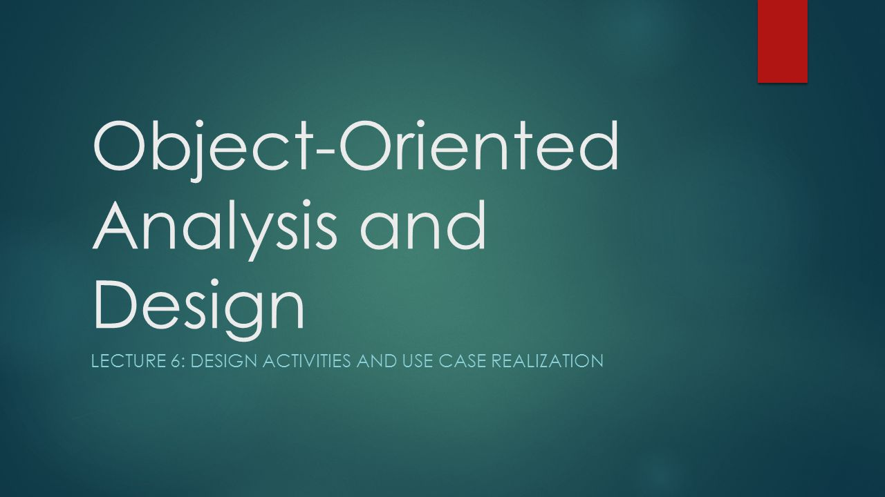

<h1 align="center">Python và Thiết kế Hướng đối tượng (OOD)</h1>

Repo này được dịch lại từ [tssovi](https://github.com/tssovi/grokking-the-object-oriented-design-interview) nhằm giúp mọi người hiểu các khái niệm và kiến thức về thiết kế hướng đối tượng một cách dễ hiểu nhất có thể. Repo sử dụng Python làm ngôn ngữ minh hoạ. 

<h3 align="center">Thiết kế hướng đối tượng và UML</h3>

    <a href="object-oriented-design-and-uml/object-oriented-basics.md"><b>Kiến thức cơ bản về hướng đối tượng (OOD)</b></a>
     
    <a href="object-oriented-design-and-uml/object-oriented-analysis-and-design.md"><b>Phân tích và thiết kế hướng đối tượng</b></a>
     
    <a href="object-oriented-design-and-uml/what-is-uml.md"><b>UML là gì?</b></a>
     
    <a href="object-oriented-design-and-uml/use-case-diagrams.md"><b>Sơ đồ Use Case</b></a>
     
    <a href="object-oriented-design-and-uml/class-diagram.md"><b>Sơ đồ lớp</b></a>
     
    <a href="object-oriented-design-and-uml/sequence-diagram.md"><b>Sơ đồ tuần tự</b></a>
     
    <a href="object-oriented-design-and-uml/activity-diagrams.md"><b>Sơ đồ hoạt động</b></a>

<h3 align="center">Thiết kế hướng đối tượng và ứng dụng</h3>

    <a href="object-oriented-design-case-studies/design-a-library-management-system.md"><b>Thiết kế hệ thống quản lý thư viện</b></a>
     
    <a href="object-oriented-design-case-studies/design-a-parking-lot.md"><b>Thiết kế bãi đổ xe ô tô</b></a>
     
    <a href="object-oriented-design-case-studies/design-amazon-online-shopping-system.md"><b>Thiết kế hệ thống bán hàng trực tuyến - Amazon</b></a>
     
    <a href="object-oriented-design-case-studies/design-stack-overflow.md"><b>Thiết kế Stack Overflow</b></a>
     
    <a href="object-oriented-design-case-studies/design-a-movie-ticket-booking-system.md"><b>Thiết kế hệ thống đặt vé xem phim</b></a>
     
    <a href="object-oriented-design-case-studies/design-an-atm.md"><b>Thiết kế một cây ATM</b></a>
     
    <a href="object-oriented-design-case-studies/design-an-airline-management-system.md"><b>Thiết kế hệ thống quản lý sân bay</b></a>
     
    <a href="object-oriented-design-case-studies/design-blackjack-and-a-deck-of-cards.md"><b>Thiết kế sòng bài</b></a>
     
    <a href="object-oriented-design-case-studies/design-a-hotel-management-system.md"><b>Thiết kế hệ thống quản lý khách sạn</b></a>
     
    <a href="object-oriented-design-case-studies/design-a-restaurant-management-system.md"><b>Thiết kế hệ thống quản lý nhà hàng</b></a>
     
    <a href="object-oriented-design-case-studies/design-chess.md"><b>Thiết kế bàn cờ vua</b></a>
     
    <a href="object-oriented-design-case-studies/design-an-online-stock-brokerage-system.md"><b>Thiết kế hệ thống môi giới chứng khoán trực tuyến</b></a>
     
    <a href="object-oriented-design-case-studies/design-a-car-rental-system.md"><b>Thiết kế hệ thống thuê xe</b></a>
     
    <a href="object-oriented-design-case-studies/design-linkedin.md"><b>Thiết kế LinkedIn</b></a>
     
    <a href="object-oriented-design-case-studies/design-cricinfo.md"><b>Thiết kế Cricinfo</b></a>
     
    <a href="object-oriented-design-case-studies/design-facebook.md"><b>Thiết kế mạng xã hội - Facebook</b></a>

<h3 align="center">** Sources **</h3>

    <b>Course Source: <b/></b><a href="https://www.educative.io/courses/grokking-the-object-oriented-design-interview"><b>Grokking the Object Oriented Design Interview</b></a>
     
    <b>Banner Photo Source: <b/></b><a href="https://dribbble.com"><b>Dribbble</b></a>

