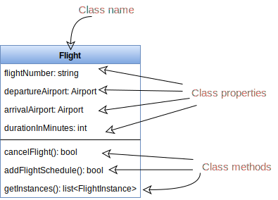

<h1 align="center">Sơ đồ Lớp</h1>

Sơ đồ lớp (class diagram) là xương sống của mô hình hoá hương đối tượng - nó hiển thị cách các thực thể (con người, vật, dữ liệu) khác nhau liên hệ với nhau. Cũng có thể nói nó biểu diễn cấu trúc tĩnh của hệ thống.

Một sơ đồ lớp mô tả thuộc tính và hoạt động của một lớp và các ràng buộc áp đặt lên hệ thống. Sơ đồ lớp được dùng rộng rãi cho mô hình hoá hệ thống hướng đối tượng vì chúng không chỉ giới hạn trong sơ đồ UML mà còn được dùng cho ánh xạ trực tiếp ở các ngôn ngữ hướng đối tượng.

Sơ đồ lớp được dùng cho những mục đích:

1. Phân tích và thiết kế hệ thống dưới góc nhìn tĩnh.
2. Mô tả nhiệm vụ của hệ thống
3. Cụng cấp cơ sở cho cấu thành và phát triển hệ thống
4. Kỹ thuật chuyển tiếp và đảo ngược.

Một lớp được mô tả trong sơ đồ lớp là một hình chữ nhật với ba phần, như hình bên dưới. Phần trên cùng là tên lớp (Flight), phần giữa là thuộc tính của lớp và phần cuối là phương thức của lớp.

    

Có nhiều kiểu quan hệ khác nhau giữa các lớp:

**Association (liên kết):**: nếu hai lớp trong mô hình cần giao tiếp với nhau, nó phải có liên kết giữa chúng. Trong sơ đồ lớp, liên kết có thể biểu diễn bằng một đường thẳng giữa hai lớp với một mũi tên chỉ ra bên yêu cầu.

* Mặc định, liên kết luôn luôn kết nối hai chiều, có nghĩa là cả hai lớp đều nhận thức được mối quan hệ với lớp còn lại. Trong sơ đồ bên dưới, liên kết giữa `Pilot` và `FlightInstance` là hai chiều, cả hai đều biết cái còn lại.

* Nếu có ràng buộc, nó là một chiều, hai lớp được liên kết - nhưng chỉ có một lớp biết được mối quan hệ. Như ví dụ bên dưới, chỉ có lớp `Flight` biết về `Aircraft`, do đó nó là liên kết một chiều.

**Multiplicity (đa dạng):** chỉ ra số lượng thực thể của một lớp tham gia vào quan hệ. Nó là một ràng buộc được chỉ định số lượng thực thể được cho phép giữa hai lớp. Ví dụ ở sơ đồ bên dưới, một `FlightInstance` sẽ có hai `Pilot`, trong khi `Pilot` có thể có nhiều `FlightInstance`. Phạm vi có thể biểu diễn là "O...*" nghĩa là "không đến nhiều" hoặc là "2...4" nghĩa là "hai đến bốn".

Ta có thể biểu thị sự đa dạng của một liên kết bằng cách thêm các ký hiệu lên trên dòng biểu diễn liên kết đó. Như sơ đồ bên dưới mình hoạ, một `FlightInstance` có chính xác hai `Pilot` còn `Pilot` có nhiều `FlightInstance`.

    
     
    Sơ đồ lớp cho hệ thống đặt chỗ chuyến bay

**Aggregation (tổng hợp):** là một kiểu đặc biệt của liên kết sử dụng để mô hình mối quan hệ "whole to its parts". Trong một mối quan hệ này, vòng đời của một lớp PART là độc lập với vòng đời của lớp WHOLE. Nói cách khác, tổng hợp ngụ ý một mối quan hệ nơi các phần tử con có thể tồn tại độc lập với cha. Trong mô hình bên dưới, `Aircraft` có thể không cần đến `Airline`.

**Composition (thành phần):** mối quan hệ tổng hợp thành phần đơn giản là một biểu diễn khác của quan hệ tổng hợp, nhưng ngược lại vì vòng đời của lớp con phải phụ thuộc vào lớp cha. Nói đơn giản, là phần tử con không thể tồn tại khi thiếu phần tử cha. Trong ví dụ bên dưới, `WeeklySchedule`
là con của `Flight`, đồng nghĩa khi `Flight` kết thúc, `WeeklySchedule` cũng bị huỷ.

**Generalization (khái quát hoá):** là phương thức gộp các lớp tương đồng của đối tượng thành một hay nhiều lớp chung. Khái quát hoá định nghĩa một khái niệm chung bao gồm một tập hợp thực thể. Như sơ đồ bên dưới, `Crew`, `Pilot` và `Admin` tất cả đều là `Person`.

**Dependency (phụ thuộc):** một quan hệ phụ thuộc là quan hệ mà một lớp (client), sử dụng hoặc phụ thuộc vào một lớp khác (supplier). Trong sơ đồ bên dưới `FlightReservation` phụ thuộc vào `Payment`.

**Abstract Class (lớp trừu tượng):** được xác định bằng cách chỉ định tên của nó bằng chữ in nghiêng. Trong sơ đồ trên, cả hai lớp `Person` và `Account` đều là các lớp trừu tượng.

    

