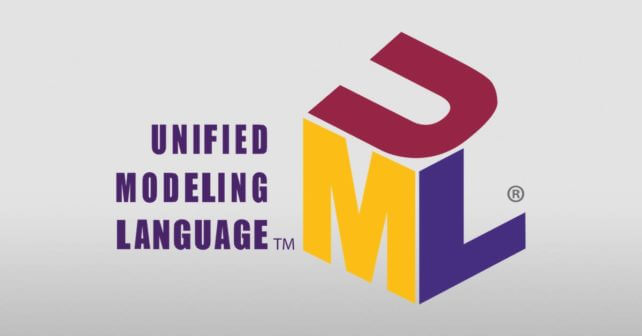

<h1 align="center">UML là gì?</h1>

Ngôn ngữ mô hình hoá thống nhất (tiếng anh là Unified Modeling Language: UML) thường được sử dụng cho phân tích và thiết kế hướng đối tượng trong các hệ thống phần mềm. UML sử dụng các sơ đồ để tạo ra cái nhìn trực quan và rõ ràng giúp cho các dev, kỹ sư hệ thống và người quản lý hiểu rõ được cấu trúc và hành vi của hệ thống khi thiết kế.

Lợi ích của UML:

1. Giúp dễ dàng nắm bắt được kiến trúc và chức năng của hệ thống phần mềm.
2. UML chuyển đổi một hệ thống phức tạp thành các phần đơn giản có thể hiểu được dễ dàng.
3. Ký hiệu đồ hoạ trong UML có thể dùng để truyền đạt ý tưởng thiết kế.
4. Vì UML là độc lập với bất kỳ nền tảng hay ngôn ngữ lập trình nào, nên nó dễ dàng biểu diễn các khái niệm trừu tượng.
5. Dễ dàng bàn giao hệ thống cho team mới.

    

**Các loại sơ đồ UML**: Ở hiện tại UML có khoảng 14 loại sơ đồ. Các sơ đồ này được chia thành hai nhóm là: sơ đồ cấu trúc và sơ đồ hành vi. Đúng như tên gọi sơ đồ cấu trúc mô tả và phân tích cấu trúc của hệ thống, trong khi đó sơ đồ hành vi mô tả các hành vi của hệ thống, tác nhân và các thành phần tạo nên nó.

**Sơ đồ cấu trúc (Structure Diagram)**

* Sơ đồ lớp - Class diagram
* Sơ đồ đối tượng - Object diagram
* Sơ đồ gói - Package diagram
* Sơ đồ thành phần - Component diagram
* Sơ đồ cây - Composite structure diagram
* Sơ đồ phát triển - Deployment diagram
* Sơ đồ hồ sơ - Profile diagram

**Sơ đồ hành vi (Behavioral Diagram)**

* Sơ đồ tình huống sử dụng - Use case diagram
* Sơ đồ hoạt động - Activity diagram
* Sơ đồ trình tự - Sequence diagram
* Sơ đồ trạng thái - State diagram
* Sơ đồ giao tiếp - Communication diagram
* Sơ đồ tương tác - Interaction overview diagram
* Sơ đồ phối hợp thời gian - Timing diagram

Ở đầy, ta sẽ chỉ tập trung vào một vài sơ đồ UML:

**Use Case Diagram**: sử dụng để mô tả các trường hợp với người dùng, sơ đồ này minh hoạ các chức năng mà hệ thống cung cấp.

**Class Diagram**: sử dụng để mô tả cấu trúc và hành vi của hệ thống với người dùng trong các bối cảnh cụ thể. Sơ đồ này cung cấp một mô hình sơ bộ của hệ thống dưới dạng các thực thể và quan hệ của chúng.

**Activity Diagram**: dùng để tạo mô hình cho luồng chức năng hoạt động giữa hai hay nhiều lớp đối tượng.

**Sequence Diagram**: dùng để mô tả tương tác trong các lớp dưới dạng các thông điệp thay đổi theo thời gian.