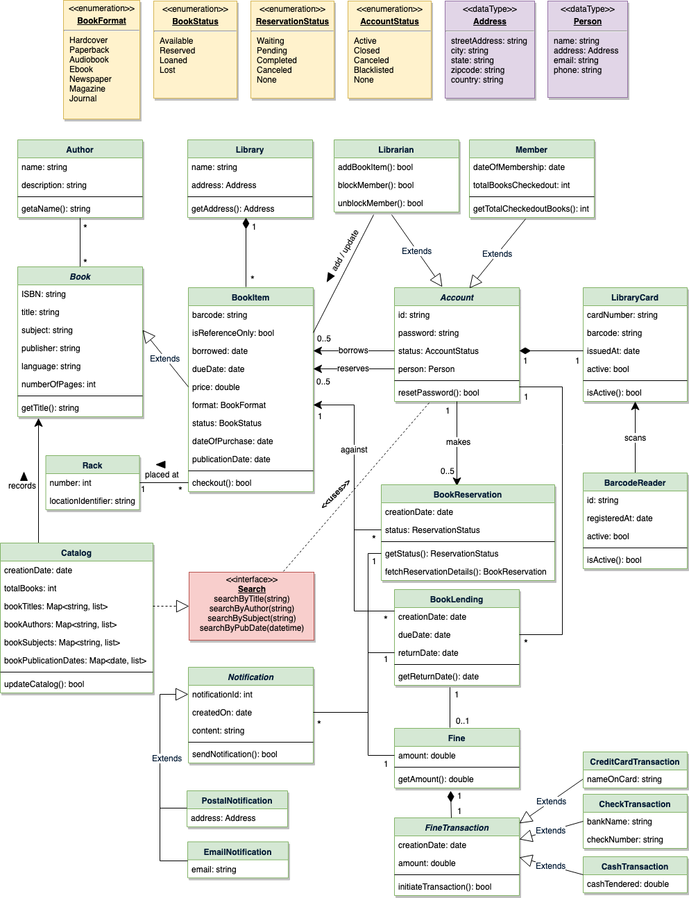

<h1 align="center">Thiết Kế Hệ Thống Quản Lý Thư Viện</h1>

**Ta sẽ thiết kế theo thứ tự sau:**

* [Yêu cầu hệ thống](#yêu-cầu-hệ-thống)
* [Use Case Diagram](#use-case-diagram)
* [Class Diagram](#class-diagram)
* [Activity Diagrams](#activity-diagrams)
* [Code](#code)

Hệ thống quản lý thư viện là một phần mềm được tạo để xử lý các công việc chính của thư viện. Thủ thư dựa vào hệ thống quản lý để quản lý tài sản thư viện cũng như liên hệ đến các thành viên khác. Hệ thống quản lý giúp người thủ thư theo dõi và kiểm tra sách, cũng như đăng ký thành viên người dùng.

Hệ thống thư viện còn bao gồm việc duy trì cơ sở dữ liệu cho nhập sách mới và ghi lại những sách nào đã cho mượn và thời hạn trả.

    
     
    Hệ thống quản lý thư viện

### Yêu cầu hệ thống

    <b>
        <i>
            Luôn làm rõ yêu cầu khi bắt đầu phỏng vấn. Đảm bảo trong đầu
            luôn có các câu hỏi để xác định chính xác phạm vi của hệ thống.
        </i>
    </b>

Ta sẽ tập trung vào tập hợp yêu cầu sau khi thiết kế hệ thống quản lý thư viện:

1. Bất kỳ thành viên nào của thư viện cũng có thể tìm sách theo tiêu đề, tác giả, danh mục cũng như ngày phát hành.
2. Mỗi sách phải có số định danh duy nhất và các chi tiết khác như số tủ để xác định vị trí lưu trữ sách thực tế.
3. Có nhiều hơn một bản sao sách, và thành viên thư viện có thể mượn và đặt trước bất kỳ bản sao nào. Ta gọi mỗi bản sao của sách là một mục sách.
4. Hệ thống có thể lấy thông tin người mượn sách hoặc sách đã cho mượn bởi thành viên cụ thể của thư viện.
5. Giới hạn số lượng (5) mà một thành viên có thể mượn.
6. Giới hạn số ngày (10) mà thành viên có thể giữ sách.
7. Hệ thống có thể tính toán và phạt tiền khi sách quá hạn trả.
8. Thành viên có thể đặt trước sách chưa có trong thư viện.
9. Hệ thống có thể gửi thôg báo khi sách đặt trước đã có, cũng như khi sách quá hạn trả.
10. Mỗi sách và thẻ thư viện có mã vạch riêng. Hệ thống sẽ đọc mã vạch từ sách và thẻ thư viện.

### Sơ đồ Use Case

Ta có ba tác nhân chính trong hệ thống:

- **Librarian (thủ thư)**: có nhiệm vụ chính là thêm và chỉnh sửa sách, mục sách và người dùng. Thủ thư còn có thể phát hành, đặt trước và trả về mục sách.
- **Member (thành viên)**: tất cả thành viên có thể tìm kiếm danh mục, cũng như mượn, đặt trước, làm mới và trả sách.
- **System (hệ thống)**: có nhiệm vụ chính là gửi thông báo khi hết hạn mượn sách, huỷ đặt trước,...

Ở đây ta có các use case quan trọng trong Hệ thống quản lý thư viện:

- **Thêm/Sửa/Xoá sách**: Để thêm, chỉnh sửa và xoá sách hay mục sách.
- **Tìm danh mục**: Để tìm kiếm sách theo tiêu đề, tác giả, danh mục hay ngày phát hành.
- **Đăng ký tài khoản/Huỷ thành viên**: thêm thành viên mới hoặc xoá thành viên đã tồn tại.
- **Mượn sách**: Mượn sách từ thư viện
- **Đặt trước sách**: Đặt trước sách chưa có.
- **Làm mới sách**: mượn lại sách đã mượn.
- **Trả sách**: Trả sách cho thư viện được mượn bởi thành viên.

    
     
    Sơ đồ Use Case cho hệ thống quản lý thư viện

### Sơ đồ lớp

Các lớp chính của hệ thống quản lý thư viện:

- **Library (thư viện)** Thành phần trung tâm cho thiết kế phần mềm. Nó có thuộc tính "Name" để phân biệt các thư viện khác nhau và "Address" để mô tả vị trí của nó.
- **Book (sách)** thành phần cơ bản của hệ thống. Mỗi sách sẽ có `ISBN`, `Title`, `Subject`, `Publishers` ,...
- **BookItem (mục sách)** bất kỳ sách nào cũng có nhiều bản copy, mỗi bản copy là một mục sách trong hệ thống. Mỗi sách sẽ có một mã vạch duy nhất.
- **Account (người dùng)** ta có hai loại người dùng, là thành viên thông thường và thủ thư.
- **LibraryCard** mỗi người dùng thư viện sách có một thẻ thư viện được dùng cho định danh người dùng khi mượn hoặc trả sách.
- **BookReservation** có nhiệm vụ quản lý thông tin đặt trước sách.
- **BookLending** quản lý mượn sách
- **Catalog** Danh mục sách được sắp xếp theo tiêu chuẩn nào đó. Hệ thống cung cấp tìm kiếm theo: Tiêu đề, tác giả, danh mục và ngày phát hành.
- **Fine** lớp này có nhiệm vụ tính toán và thu giữ tiền phạt từ thành viên.
- **Author** lớp cho tác giả sách.
- **Rack** Sách sẽ được trên tủ. Mỗi tủ sẽ có định danh số tủ và vị trí để mô tả vị trí thực tể của tủ trong thư viện.
- **Notification** lớp gửi thông báo cho các thành viên thư viện.

    
     
    Sơ đồ lớp cho hệ thống quản lý thư viện

    
     
    Sơ đồ UML cho hệ thống quản lý thư viện

### Sơ đồ hoạt động

**Mượn sách**: bất kỳ thành viên thư viện nào cũng có thể thực hiện hành động này. Ở đây ta có các bước cho mượn sách.

    
     
    Sơ đồ hoạt động cho mượn sách

