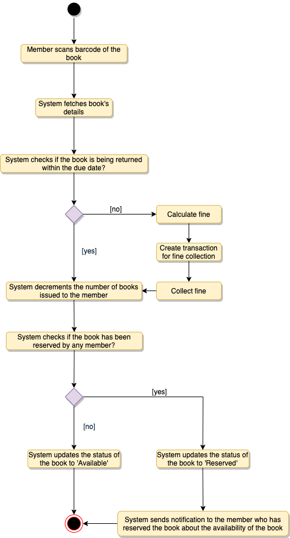

<h1 align="center">Thiết Kế Hệ Thống Quản Lý Thư Viện</h1>

**Ta sẽ thiết kế theo thứ tự sau:**

* [Yêu cầu hệ thống](#yêu-cầu-hệ-thống)
* [Sơ đồ Use Case](#sơ-đồ-use-case)
* [Sơ đồ lớp](#sơ-đồ-lớp)
* [Sơ đồ hoạt động](#sơ-đồ-hoạt-động)
* [Code](#code)

Hệ thống quản lý thư viện là một phần mềm được tạo để xử lý các công việc chính trong thư viện. Thủ thư dựa vào hệ thống quản lý để quản lý tài sản thư viện cũng như liên hệ đến các thành viên khác. Hệ thống quản lý giúp người thủ thư theo dõi và kiểm tra sách, cũng như đăng ký thành viên người dùng.

Hệ thống thư viện còn bao gồm việc duy trì cơ sở dữ liệu cho nhập sách mới và ghi lại những sách nào đã cho mượn và thời hạn trả.

<p align="center">
    
    <br />
    Hệ thống quản lý thư viện
</p>

### Yêu cầu hệ thống

<p align="center">
    <b>
        <i>
            Luôn làm rõ yêu cầu khi bắt đầu phỏng vấn. Đảm bảo trong đầu
            luôn có các câu hỏi để xác định chính xác phạm vi của hệ thống.
        </i>
    </b>
</p>

Ta sẽ tập trung vào tập hợp yêu cầu sau khi thiết kế hệ thống quản lý thư viện:

1. Bất kỳ thành viên nào của thư viện cũng có thể tìm sách theo tiêu đề, tác giả, danh mục cũng như ngày phát hành.
2. Mỗi sách phải có số định danh duy nhất và các chi tiết khác như số tủ để xác định vị trí lưu trữ sách thực tế.
3. Có nhiều hơn một bản sao sách, và thành viên thư viện có thể mượn và đặt trước bất kỳ bản sao nào. Ta gọi mỗi bản sao của sách là một mục sách.
4. Hệ thống có thể lấy thông tin người mượn sách hoặc sách đã cho mượn bởi thành viên cụ thể của thư viện.
5. Giới hạn số lượng (5) mà một thành viên có thể mượn.
6. Giới hạn số ngày (10) mà thành viên có thể giữ sách.
7. Hệ thống có thể tính toán và phạt tiền khi sách quá hạn trả.
8. Thành viên có thể đặt trước sách chưa có trong thư viện.
9. Hệ thống có thể gửi thông báo khi sách đặt trước đã có, cũng như khi sách quá hạn trả.
10. Mỗi sách và thẻ thư viện có mã vạch riêng. Hệ thống sẽ đọc mã vạch từ sách và thẻ thư viện.

### Sơ đồ Use Case

Ta có ba tác nhân chính trong hệ thống:

- **Librarian (thủ thư)**: có nhiệm vụ chính là thêm, chỉnh sửa sách, mục sách và người dùng. Thủ thư cũng có thể mượn, đặt trước và trả lại sách hay mục sách.
- **Member (thành viên)**: tất cả thành viên có thể tìm kiếm danh mục, cũng như mượn, đặt trước, gia hạn và trả sách.
- **System (hệ thống)**: có nhiệm vụ chính là gửi thông báo khi hết hạn mượn sách, huỷ đặt trước,...

Ở đây ta có các use case quan trọng trong Hệ thống quản lý thư viện:

- **Thêm/Sửa/Xoá sách**: Để thêm, chỉnh sửa và xoá sách hay mục sách.
- **Tìm danh mục**: Để tìm kiếm sách theo tiêu đề, tác giả, danh mục hay ngày phát hành.
- **Đăng ký tài khoản/Huỷ thành viên**: thêm thành viên mới hoặc xoá thành viên đã tồn tại.
- **Mượn sách**: Mượn sách từ thư viện
- **Đặt trước sách**: Đặt trước sách chưa có.
- **Gia hạn sách**: gia hạn sách đã mượn.
- **Trả sách**: Trả sách cho thư viện được mượn bởi thành viên.

<p align="center">
    
    <br />
    Sơ đồ Use Case cho hệ thống quản lý thư viện
</p>

### Sơ đồ lớp

Các lớp chính của hệ thống quản lý thư viện:

- **Library:** thành phần trung tâm cho thiết kế phần mềm. Nó có thuộc tính "Name" để phân biệt các thư viện khác nhau và "Address" để mô tả vị trí của nó.
- **Book:** thành phần cơ bản của hệ thống. Mỗi sách sẽ có `ISBN`, `Title`, `Subject`, `Publishers` ,...
- **BookItem:** bất kỳ sách nào cũng có nhiều bản sao, mỗi bản sao là một mục sách trong hệ thống. Mỗi sách sẽ có một mã vạch duy nhất.
- **Account:** ta có hai loại người dùng, là thành viên thông thường và thủ thư.
- **LibraryCard:** mỗi thành viên thư viện có một thẻ thư viện được dùng cho định danh người dùng khi mượn hoặc trả sách.
- **BookReservation:** có nhiệm vụ quản lý thông tin đặt trước sách.
- **BookLending:** quản lý mượn sách
- **Catalog:** Danh mục sách được sắp xếp theo tiêu chuẩn nào đó. Hệ thống cung cấp tìm kiếm theo: Tiêu đề, tác giả, danh mục và ngày phát hành.
- **Fine:** lớp này có nhiệm vụ tính toán và thu giữ tiền phạt từ thành viên.
- **Author:** lớp cho tác giả sách.
- **Rack:** sách sẽ được đặt trên tủ. Mỗi tủ sẽ có định danh số tủ và vị trí để mô tả vị trí thực tể của tủ trong thư viện.
- **Notification:** lớp gửi thông báo cho các thành viên thư viện.

<p align="center">
    
    <br />
    Sơ đồ lớp cho hệ thống quản lý thư viện
</p>

<p align="center">
    
    <br />
    Sơ đồ UML cho hệ thống quản lý thư viện
</p>

### Sơ đồ hoạt động

**Mượn sách**: bất kỳ thành viên thư viện nào cũng có thể thực hiện hành động này. Ở đây ta có các bước cho mượn sách.

<p align="center">
    
    <br />
    Sơ đồ hoạt động cho mượn sách
</p>

**Trả sách**: bất kỳ thành viên thư viện nào cũng có thể thực hiện hành động này. Hệ thống sẽ thu tiền phạt từ thành viên nếu họ trả sách quá hạn. Các bước cho trả sách.

<p align="center">
    
    <br />
    Sơ đồ hoạt động cho trả sách
</p>

**Gia hạn sách**: khi gia hạn sách, hệ thống sẽ kiểm tra tiền phạt và nếu có bất kỳ thành viên nào khác đặt trước cùng quyển sách ấy, sẽ không thể gia hạn. Đây là các bước cho gia hạn sách.

<p align="center">
    
    <br />
    Sơ đồ hoạt động cho gia hạn
</p>

### Code

Ở đây code tập trung vào 3 tình huống cụ thể là:
1. Mượn sách
2. Trả sách
3. Gia hạn

*Lưu ý*: Code này chỉ tập trung vào thiết kế cho tình huống cụ thể. Nó chủ yếu dành cho các cuộc phỏng vấn nên sẽ không đi sâu vào các chi tiết cụ thể như kết nối cơ sở dữ liệu hay hệ thống thanh toán.

**Enum và Constants**: 

```python
from abc import ABC
from enum import Enum


class BookFormat(Enum):
    HARDCOVER, PAPERBACK, AUDIO_BOOK, EBOOK, NEWSPAPER, MAGAZINE, JOURNAL = 1, 2, 3, 4, 5, 6, 7


class BookStatus(Enum):
    AVAILABLE, RESERVED, LOANED, LOST = 1, 2, 3, 4


class ReservationStatus(Enum):
    WAITING, PENDING, CANCELED, NONE = 1, 2, 3, 4


class AccountStatus(Enum):
    ACTIVE, CLOSED, CANCELED, BLACKLISTED, NONE = 1, 2, 3, 4, 5


class Address:
    def __init__(self, street, city, state, zip_code, country):
        self.__street_address = street
        self.__city = city
        self.__state = state
        self.__zip_code = zip_code
        self.__country = country


class Person(ABC):
    def __init__(self, name, address, email, phone):
        self.__name = name
        self.__address = address
        self.__email = email
        self.__phone = phone


class Constants:
    def __init__(self):
          self.MAX_BOOKS_ISSUED_TO_A_USER = 5
          self.MAX_LENDING_DAYS = 10
```

**Tài khoản thành viên và thủ thư:**: Các lớp này biểu diễn các người dùng khác nhau tương tác với hệ thống.

```python
# Để đơn giản hoá, ta sẽ không định nghĩa các hàm getter và setter.
# Người đọc có thể giả sử tất cả thuộc tính lớp là riêng tư và phải
# truy cập thông qua phương thức getter công khai và chỉnh sửa thông
# qua các hàm công khai.


from abc import ABC
from datetime import datetime

from .constants import *
from .models import *


class Account(ABC):
    def __init__(self, id, password, person, status=AccountStatus.Active):
        self.__id = id
        self.__password = password
        self.__status = status
        self.__person = person

    def reset_password(self):
        None


class Librarian(Account):
    def __init__(self, id, password, person, status=AccountStatus.Active):
        super().__init__(id, password, person, status)

    def add_book_item(self, book_item):
        None

    def block_member(self, member):
        None

    def un_block_member(self, member):
        None


class Member(Account):
    def __init__(self, id, password, person, status=AccountStatus.Active):
        super().__init__(id, password, person, status)
        self.__date_of_membership = datetime.date.today()
        self.__total_books_checkedout = 0

    def get_total_books_checkedout(self):
        return self.__total_books_checkedout

    def reserve_book_item(self, book_item):
        None

    def increment_total_books_checkedout(self):
        None

    def renew_book_item(self, book_item):
        None

    def checkout_book_item(self, book_item):
        if self.get_total_books_checked_out() >= Constants.MAX_BOOKS_ISSUED_TO_A_USER:
            print("The user has already checked-out maximum number of books")
            return False
        book_reservation = BookReservation.fetch_reservation_details(book_item.get_barcode())
        if book_reservation != None and book_reservation.get_member_id() != self.get_id():
            # book item has a pending reservation from another user
            print("self book is reserved by another member")
            return False
        elif book_reservation != None:
            # book item has a pending reservation from the give member, update it
            book_reservation.update_status(ReservationStatus.COMPLETED)

        if not book_item.checkout(self.get_id()):
            return False

        self.increment_total_books_checkedout()
        return True

    def check_for_fine(self, book_item_barcode):
        book_lending = BookLending.fetch_lending_details(book_item_barcode)
        due_date = book_lending.get_due_date()
        today = datetime.date.today()
        # check if the book has been returned within the due date
        if today > due_date:
            diff = today - due_date
            diff_days = diff.days
            Fine.collect_fine(self.get_member_id(), diff_days)

    def return_book_item(self, book_item):
        self.check_for_fine(book_item.get_barcode())
        book_reservation = BookReservation.fetch_reservation_details(book_item.get_barcode())
        if book_reservation != None:
            # book item has a pending reservation
            book_item.update_book_item_status(BookStatus.RESERVED)
            book_reservation.send_book_available_notification()
            book_item.update_book_item_status(BookStatus.AVAILABLE)

    def renew_book_item(self, book_item):
        self.check_for_fine(book_item.get_barcode())
        book_reservation = BookReservation.fetch_reservation_details(
        book_item.get_barcode())
        # check if self book item has a pending reservation from another member
        if book_reservation != None and book_reservation.get_member_id() != self.get_member_id():
            print("self book is reserved by another member")
            self.decrement_total_books_checkedout()
            book_item.update_book_item_state(BookStatus.RESERVED)
            book_reservation.send_book_available_notification()
            return False
        elif book_reservation != None:
            # book item has a pending reservation from self member
            book_reservation.update_status(ReservationStatus.COMPLETED)

        BookLending.lend_book(book_item.get_bar_code(), self.get_member_id())
        book_item.update_due_date(datetime.datetime.now().AddDays(Constants.MAX_LENDING_DAYS))
        return True
```

**Đặt trước, mượn sách và phạt:** Các lớp này biểu diễn nơi đặt trước sách, mươn và thu phí phạt.

```python
class BookReservation:
    def __init__(self, creation_date, status, book_item_barcode, member_id):
        self.__creation_date = creation_date
        self.__status = status
        self.__book_item_barcode = book_item_barcode
        self.__member_id = member_id

    def fetch_reservation_details(self, barcode):
        None


class BookLending:
    def __init__(self, creation_date, due_date, book_item_barcode, member_id):
        self.__creation_date = creation_date
        self.__due_date = due_date
        self.__return_date = None
        self.__book_item_barcode = book_item_barcode
        self.__member_id = member_id

    def lend_book(self, barcode, member_id):
        None

    def fetch_lending_details(self, barcode):
        None


class Fine:
    def __init__(self, creation_date, book_item_barcode, member_id):
        self.__creation_date = creation_date
        self.__book_item_barcode = book_item_barcode
        self.__member_id = member_id

    def collect_fine(self, member_id, days):
        None
```

**Mục sách:** Đóng gói các mục sách, lớp này có trách nhiệm xử lý quá trình mượn, trả và gia hạn sách.

```python
from abc import ABC
from .constants import *


class Book(ABC):
    def __init__(self, ISBN, title, subject, publisher, language, number_of_pages):
        self.__ISBN = ISBN
        self.__title = title
        self.__subject = subject
        self.__publisher = publisher
        self.__language = language
        self.__number_of_pages = number_of_pages
        self.__authors = []


class BookItem(Book):
    def __init__(self, barcode, is_reference_only, borrowed, due_date, price, book_format, status,
                 date_of_purchase, publication_date, placed_at):
        self.__barcode = barcode
        self.__is_reference_only = is_reference_only
        self.__borrowed = borrowed
        self.__due_date = due_date
        self.__price = price
        self.__format = book_format
        self.__status = status
        self.__date_of_purchase = date_of_purchase
        self.__publication_date = publication_date
        self.__placed_at = placed_at

    def checkout(self, member_id):
        if self.get_is_reference_only():
            print("self book is Reference only and can't be issued")
            return False
        if not BookLending.lend_book(self.get_bar_code(), member_id):
            return False
        self.update_book_item_status(BookStatus.LOANED)
        return True


class Rack:
    def __init__(self, number, location_identifier):
        self.__number = number
        self.__location_identifier = location_identifier
```


**Tìm kiếm danh mục:** Lớp `Catalog` sẽ triển khai interface `Search` cho tìm kiếm sách.

```python
from abc import ABC


class Search(ABC):
    def search_by_title(self, title):
        None

    def search_by_author(self, author):
        None

    def search_by_subject(self, subject):
        None

    def search_by_pub_date(self, publish_date):
        None


class Catalog(Search):
    def __init__(self):
        self.__book_titles = {}
        self.__book_authors = {}
        self.__book_subjects = {}
        self.__book_publication_dates = {}

    def search_by_title(self, query):
        # return all books containing the string query in their title.
        return self.__book_titles.get(query)

    def search_by_author(self, query):
        # return all books containing the string query in their author's name.
        return self.__book_authors.get(query)
```