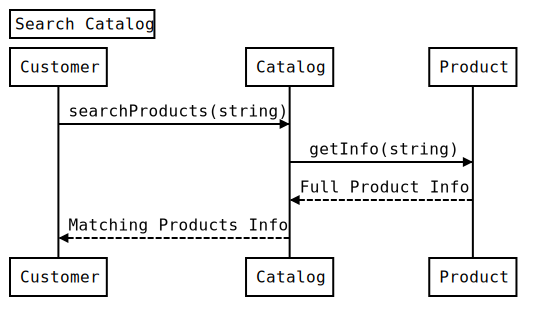

<h1 align="center">Thiết kế Trang Amazon - Hệ Thống Bán Hàng Trực Tuyến</h1>

**Ta sẽ thiết kế theo thứ tự sau:**

* [Yêu cầu hệ thống](#yêu-cầu-hệ-thống)
* [Sơ đồ Use Case](#sơ-đồ-use-case)
* [Sơ đồ lớp](#sơ-đồ-lớp)
* [Sơ đồ hoạt động](#sơ-đồ-hoạt-động)
* [Code](#code)

Trang Amazon ([amazon.com](https://www.amazon.com/)) là trang thương mại điện tử cho bán lẻ lớn nhất thế giới. Công ty ban đầu là một nhà bán sách nhưng đã mở rộng để bán nhiều loại hàng tiêu dùng và thiết bị kỹ thuật số. Vì vậy ta sẽ tập trung vào hoạt động kinh doanh bán lẻ trực tuyến của họ, nơi người dùng có thể mua/bán sản phẩm của họ. 

<p align="center">
    
    <br />
    Amazon - Online Shopping System
</p>

### Yêu cầu hệ thống

Ta sẽ thiết kế một hệ thống với các yêu cầu sau:

1. Người dùng có thể thêm sản phẩm để bán
2. Người dùng có thể tìm kiếm sản phẩm bằng tên hay danh mục.
3. Người dùng có thể tìm mọi sản phẩm, nhưng chỉ có thành viên đã đăng ký mới có thể mua sản phẩm
4. Người dùng có thể thêm/sửa/xoá sản phẩm trong giỏ hàng của họ
5. Người dùng có thể checkout và mua hàng từ giỏ hàng.
6. Người dùng có thể đánh giá và review sản phẩm.
7. Người dùng nên có địa chỉ giao hàng cụ thể khi đặt để chuyển hàng đến.
8. Người dùng có thể huỷ đơn đặt hàng.
9. Người dùng có thể nhận thông báo bất cứ khi nào trạng thái đơn hàng thay đổi.
10. Người dùng có thể trả qua thẻ ngân hàng hay chuyển khoản.
11. Người dùng có thể theo dõi quá trình giao hàng.

### Sơ đồ use case

Ta có 4 tác nhân chính trong hệ thống:

* **Admin:** có trách nhiệm chính là quản lý người dùng và thêm, sửa xoá danh mục sản phẩm.
* **Guest:** tất cả khách có thể tìm kiếm sản phẩm theo danh muc, thêm, xoá sản phẩm trong giỏ hàng và đăng ký thành viên.
* **Member:** thành viên có thể thực hiện mọi hành động của khách đồng thời có thể đặt hoá đơn và thêm sản phẩm để bán.
* **System:** có trách nhiệm gửi thông báo mỗi khi thay đổi trạng thái của hoá đơn và cập nhập giao hàng.

Ta có các use case chính trong hệ thống bán hàng trực tuyến:

1. Thêm/cập nhật sản phẩm. Bất cứ khi nào một sản phẩm được thêm hay sửa đổi ta phải cập nhật lại danh mục.
2. Tìm kiếm sản phẩm theo tên hoặc danh mục.
3. Thêm/xoá sản phẩm trong giỏ hàng
4. Checkout để mua sản phẩm trong giỏ hàng.
5. Chọn phương thức thanh toán.
6. Thêm danh mục sản phẩm mới.
7. Gửi thông báo khi cập nhật trạng thái vấn chuyển.

Đây là sơ đồ use case của hệ thống bán hàng:

<p align="center">
    
    <br />
    Use Case Diagram for Online Shoopping System
</p>

### Sơ đồ lớp

Ở đây có mô tả các lớp khác nhau dùng trong hệ thống bán hàng trực tuyến:


* **Account:** có hai kiểu tài khoản đã đăng ký: một cho admin, người có thể thêm danh mục sản phẩm mới và chặn tài khoản thành viên; hai là tài khoản thành viên có thê mua bán sản phẩm.
* **Guest:** khách có thể tìm kiếm và xem sản phẩm, đồng thời có thể thêm xoá sản phẩm trong giỏ hàng. Để đặt hoá đơn, khách buộc phải đăng ký thành viên.
* **Catalog:** người dùng của hệ thống có thể tìm kiếm sản phẩm theo tên hoặc danh mục. Lớp này đánh chỉ số cho tất cả sản phẩm để tìm kiếm nhanh hơn.
* **ProductCategory:** lớp này đóng gói các danh mục sản phẩm khác nhau như sách, đồ điện tử,...
* **Product:** lớp này đóng gói một thực thể để người dùng có thể mua và bán. Mỗi sản phẩm sẽ đi kèm với một danh mục sản phẩm.
* **ProductReview:** bất kỳ tài khoản đã đăng ký nào cũng có thể đánh giá sản phẩm.
* **ShoppingCart:** người dùng có thể thêm sản phẩm họ dự định mua vào giỏ hàng.
* **Item:** lớp này đóng gói các sản phẩm cụ thể sẽ được bán cho người dùng trong giỏ hàng. Ví dụ, một quyển sách là một sản phẩm, trong kho có 10 quyển sách, mỗi quyển sách trong số 10 quyển này là một **item**.
* **Order**: lớp này đóng gói một đơn hàng để bán tất cả mọi thứ trong giỏ hàng.
* **OrderLog:** theo dõi trạng thái của hoá đơn như là unshipped, pending, complete, canceled, ...
* **ShipmentLog:** theo dõi trạng thái của vận chuyển như là pending, shipped, delivered, etc.
* **Notification:** lớp này có nhiệm vụ gửi thông báo đến cho khách hàng. 
* **Payment:** lớp này đóng gói phương thức thanh toán cho đơn hàng. Có thể là qua chuyển khoản hoặc thẻ ngân hàng.

<p align="center">
    
    <br />
    Class Diagram for Online Shoopping System
</p>

<p align="center">
    
    <br />
    UML for Online Shoopping System
</p>

### Sơ đồ hoạt động

Sơ đồ hoạt động cho các hành động của người dùng trong cửa hàng trực tuyến:

<p align="center">
    
    <br />
    Activity Diagram for Online Shoopping System
</p>

### Sơ đồ trình tự

1. Sơ đồ trình tự cho tìm kiếm từ danh mục

<p align="center">
    
    <br />
    Sequence Diagram for Online Shoopping System
</p>

2. Sơ đồ trình tự cho thêm sản phẩm vào giỏ hàng

<p align="center">
    
    <br />
    Sequence Diagram for Online Shoopping System
</p>

3. Sơ đồ trình tự cho đặt hoá đơn

<p align="center">
    
    <br />
    Sequence Diagram for Online Shoopping System
</p>

### Code

Xác định high-level cho các mô tả lớp

**Enum, kiểu dữ liệu và hằng số**: 

```python
from enum import Enum


class Address:
    def __init__(self, street, city, state, zip_code, country):
        self.__street_address = street
        self.__city = city
        self.__state = state
        self.__zip_code = zip_code
        self.__country = country


class OrderStatus(Enum):
    UNSHIPPED, PENDING, SHIPPED, COMPLETED, CANCELED, REFUND_APPLIED = 1, 2, 3, 4, 5, 6


class AccountStatus(Enum):
    ACTIVE, BLOCKED, BANNED, COMPROMISED, ARCHIVED, UNKNOWN = 1, 2, 3, 4, 5, 6


class ShipmentStatus(Enum):
    PENDING, SHIPPED, DELIVERED, ON_HOLD = 1, 2, 3, 4


class PaymentStatus(Enum):
    UNPAID, PENDING, COMPLETED, FILLED, DECLINED, CANCELLED, ABANDONED, SETTLING, SETTLED, REFUNDED = 1, 2, 3, 4, 5, 6, 7, 8, 9, 10


```

**Account, Customer, Admin, and Guest:** Các lớp biểu diễn các người dùng khác nhau tương tác với hệ thống.

```python
from abc import ABC
from .constants import *


# For simplicity, we are not defining getter and setter functions. The reader can
# assume that all class attributes are private and accessed through their respective
# public getter methods and modified only through their public methods function.


class Account:
    def __init__(self, user_name, password, name, email, phone, shipping_address, status=AccountStatus):
        self.__user_name = user_name
        self.__password = password
        self.__name = name
        self.__email = email
        self.__phone = phone
        self.__shipping_address = shipping_address
        self.__status = status.ACTIVE
        self.__credit_cards = []
        self.__bank_accounts = []

    def add_product(self, product):
        None

    def add_productReview(self, review):
        None

    def reset_password(self):
        None


class Customer(ABC):
    def __init__(self, cart, order):
        self.__cart = cart
        self.__order = order
    
    def get_shopping_cart(self):
        return self.__cart
    
    def add_item_to_cart(self, item):
        None
    
    def remove_item_from_cart(self, item):
        None


class Guest(Customer):
    def register_account(self):
        None


class Member(Customer):
    def __init__(self, account):
        self.__account = account
    
    def place_order(self, order):
        None


```

**ProductCategory, Product, and ProductReview:** Các lớp liên quan đến sản phẩm

```python
class ProductCategory:
    def __init__(self, name, description):
        self.__name = name
        self.__description = description


class ProductReview:
    def __init__(self, rating, review, reviewer):
        self.__rating = rating
        self.__review = review
        self.__reviewer = reviewer


class Product:
    def __init__(self, id, name, description, price, category, seller_account):
        self.__product_id = id
        self.__name = name
        self.__description = description
        self.__price = price
        self.__category = category
        self.__available_item_count = 0
        
        self.__seller = seller_account
    
    def get_available_count(self):
        return self.__available_item_count
    
    def update_price(self, new_price):
        None


```

**ShoppingCart, Item, Order, and OrderLog:** người dùng sẽ thêm sản phẩm vào giỏ hàng và đặt hoá đơn cho mua tất cả sản phẩm trong giỏ hàng.

```python
from datetime import datetime
from .constants import *


class Item:
    def __init__(self, id, quantity, price):
        self.__product_id = id
        self.__quantity = quantity
        self.__price = price
    
    def update_quantity(self, quantity):
        None


class ShoppingCart:
    def __init__(self):
        self.__items = []
    
    def add_item(self, item):
        None
    
    def remove_item(self, item):
        None
    
    def update_item_quantity(self, item, quantity):
        None
    
    def get_items(self):
        return self.__items
    
    def checkout(self):
        None


class OrderLog:
    def __init__(self, order_number, status=OrderStatus.PENDING):
        self.__order_number = order_number
        self.__creation_date = datetime.date.today()
        self.__status = status


class Order:
    def __init__(self, order_number, status=OrderStatus.PENDING):
        self.__order_number = 0
        self.__status = status
        self.__order_date = datetime.date.today()
        self.__order_log = []

    def send_for_shipment(self):
        None
    
    def make_payment(self, payment):
        None
    
    def add_order_log(self, order_log):
        None


```

**Shipment, ShipmentLog, and Notification:** Sau khi đặt hoá đơn thành công, một bản ghi vận chuyển có thể được tạo:


```python
from abc import ABC
from datetime import datetime
from .constants import *


class ShipmentLog:
    def __init__(self, shipment_number, status=ShipmentStatus.PENDING):
        self.__shipment_number = shipment_number
        self.__status = status
        self.__creation_date = datetime.date.today()


class Shipment:
    def __init__(self, shipment_number, shipment_method):
        self.__shipment_number = shipment_number
        self.__shipment_date = datetime.date.today()
        self.__estimated_arrival = datetime.date.today()
        self.__shipment_method = shipment_method
        self.__shipmentLogs = []

    def add_shipment_log(self, shipment_log):
        None


class Notification(ABC):
    def __init__(self, id, content):
        self.__notification_id = id
        self.__created_on = datetime.date.today()
        self.__content = content
    
    def send_notification(self, account):
        None


```

**Search interface and Catalog:** Danh mục cho triển khai tìm kiếm sản phẩm.


```python
from abc import ABC


class Search(ABC):
    def search_products_by_name(self, name):
        None
    
    def search_products_by_category(self, category):
        None


class Catalog(Search):
    def __init__(self):
        self.__product_names = {}
        self.__product_categories = {}
    
    def search_products_by_name(self, name):
        return self.product_names.get(name)
    
    def search_products_by_category(self, category):
        return self.product_categories.get(category)


```

