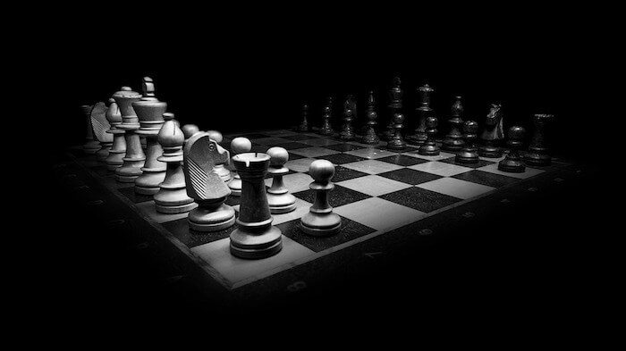
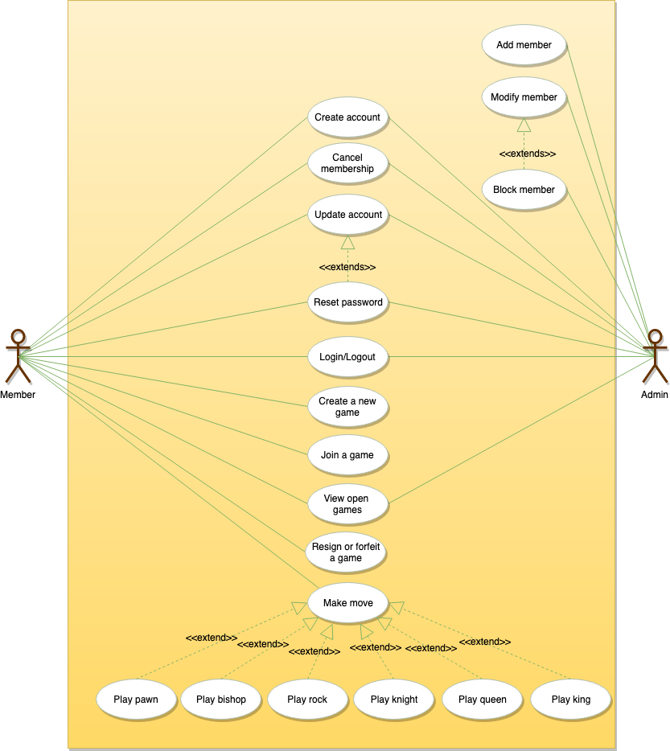

<h1 align="center">Thiết Kế Hệ Thống Cho Chơi Cờ Vua</h1>

**Ta sẽ thiết kế theo thứ tự sau:**

* [Yêu cầu hệ thống](#yêu-cầu-hệ-thống)
* [Sơ đồ Use Case](#sơ-đồ-use-case)
* [Sơ đồ lớp](#sơ-đồ-lớp)
* [Sơ đồ hoạt động](#sơ-đồ-hoạt-động)
* [Code](#code)

Cờ vua là trò chơi bảng chiến thuật dành cho hai người chơi trên một bàn cờ. Trò chơi sử dụng một bàn cờ hình vuông chia thành 64 ô vuông nhỏ hơn với 8 hàng ngang và 8 hàng dọc. Cờ vua có nhiều biến thể khác nhau được chơi trên toàn thế giới. Ở đây, chúng ta sẽ tập trung thiết kế vào phiên bản cờ vua dành cho hai người chơi.

    
     
    Chess

### Yêu cầu hệ thống

Ta sẽ tập trung vào các yêu cầu sau khi thiết kế trò chơi cờ vua:

1. Hệ thống phải hỗ trợ hai người chơi cờ vua online.
2. Luật chơi cờ tuân theo tiêu chuẩn quốc tế.
3. Mỗi người sẽ được chọn phía ngẫu nhiên, trắng hoặc đen.
4. Cả hai người chơi sẽ đi từng nước một. Bên trắng sẽ đi trước.
5. Người chơi không thể huỷ hay rút lại nước đi của họ.
6. Hệ thống nên ghi lại tất cả bước đi của cả hai người chơi.
7. Mỗi bên sẽ bắt đầu với 8 quân tốt, 2 quân xe, 2 quân ngựa, 2 quân tượng, 1 quân hậu và 1 quân vua.
8. Trò chơi sẽ kết thúc khi có một bên chiếu hết đối phương hoặc bỏ cuộc hoặc hoà cờ.

### Sơ đồ Use Case

Ta có hai tác nhân trong hệ thống:

* **Player:** Là người chơi đã đăng ký tài khoản trong hệ thống, player sẽ là người chơi cờ.
* **Admin:** Có thể cấm/chỉnh sửa player.

Các tình hướng nổi bật trong hệ thống chơi cờ:

* **Người chơi thực hiện nước đi:** cần xác nhận nước đi đó có hợp lệ hay không.
* **Xin thua hoặc bỏ cuộc:** người chơi có thể xin thua hoặc từ bỏ cuộc chơi.
* **Tạo tài khoản mới/xoá thành viên:** thêm một thành viên mới vào hoặc xoá thành viên đang tồn tại.
* **Cập nhật bản ghi bàn cờ:** thêm thông tin nước đi vào.

Đây là sơ đồ use case cho trò chơi cờ vua của chúng ta:

    
     
    Use Case Diagram for Chess

